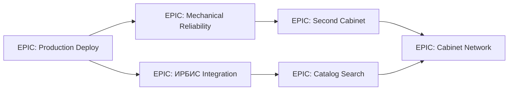

# Роадмап BookCabinet

> **Источник правды:** GitHub Milestones + GitHub Project v2 + этот файл.
> **Дашборд:** будет доступен по URL после ШАГА 9 (`https://rivega42.github.io/-/`).

---

## Видение

BookCabinet — автоматизированный библиотечный шкаф, который позволяет читателям самостоятельно брать и возвращать книги по карте ЕКП/читательскому билету, без участия библиотекаря. Цель — установка в публичных библиотеках (старт — Зеленогорская библиотека) и масштабирование сети.

Ключевые принципы:
- **Надёжность важнее фич** — это физическая машина в публичном месте.
- **Доступность** — крупные элементы UI, ЧБ-контраст, ARIA.
- **Совместимость с ИРБИС** — стандарт российских библиотек.
- **Field-knowledge сохраняется** — все диагностические/калибровочные скрипты, лог сессий, debug файлы.

---

## Quarterly Roadmap

### Q2 2026 (текущий) — Production Deploy в Зеленогорской библиотеке

**Цель:** довести шкаф до стабильной работы в реальной библиотеке.

- [x] HOME corner подтверждён (LEFT+BOTTOM)
- [x] Homing baseline 800/300 после belt slip
- [x] Production issue/return workflow (#79, #80)
- [x] Per-rack калибровка
- [x] `tools/move_shelf.py` auto-detect глубины
- [ ] Repo setup (этот PR — `chore/repo-setup`)
- [ ] Стабильный issue/return на реальном железе ≥ 100 циклов без ошибки
- [ ] ИРБИС integration smoke-test в библиотеке
- [ ] RFID UHF финальная стабилизация (IQRFID-5102)
- [ ] Telegram уведомления оператору (jam, low battery, ИРБИС down)
- [ ] Систематический disaster recovery runbook
- [ ] Production deploy (физическая установка)

### Q3 2026 — Mechanical Reliability + второй шкаф

**Цель:** масштабирование на второй экземпляр и снижение поломок.

- [ ] Decompose `client/src/pages/kiosk.tsx` (2372 строки → ≤500 на компонент)
- [ ] Frontend tests (vitest + Playwright e2e)
- [ ] Hardware self-diagnostics на старте (endstops, motor sweep, locks)
- [ ] Auto-recovery from common jams
- [ ] Унификация калибровки между шкафами (export/import calibration.json)
- [ ] Второй шкаф — деплой
- [ ] Operator dashboard (внутренний UI для библиотекаря)

### Q4 2026 / Q1 2027 — ИРБИС Integration deep + сеть

- [ ] Полная интеграция с ИРБИС (поиск по каталогу, статус заказа, броня)
- [ ] Расширенная инвентаризация (UHF batch read)
- [ ] Сеть из ≥3 шкафов с центральным мониторингом
- [ ] Multi-language UI (RU + EN)
- [ ] Open-source release / документация для других библиотек

### Long-term

- [ ] Мобильное приложение читателя
- [ ] Интеграция с городскими сервисами
- [ ] Машинное обучение для predictive maintenance

---

## Эпики и зависимости (Mermaid)

---

## Метрики успеха

| Метрика | Текущее | Цель Q2 | Цель Q3 | Цель Q4 |
|---|---|---|---|---|
| Стабильных issue/return циклов подряд | ~10 | 100 | 1000 | 10000 |
| Шкафов в production | 0 | 1 | 2 | 3+ |
| Время on-call для оператора в неделю | n/a | ≤4 ч | ≤2 ч | ≤1 ч |
| Покрытие тестами (Python) | низкое | базовое | 50% | 70% |
| Покрытие тестами (TS/TSX) | 0% | smoke | 30% | 50% |

---

## Связанные документы

- `STATE.md` — текущий снапшот
- `BACKLOG.md` — список задач
- `DECISIONS.md`, `docs/DECISIONS.md` — архитектурные решения
- `CLAUDE.md` — project brief
- `docs/SOURCES_OF_TRUTH.md`
- `docs/DEVLOG.md`
- GitHub Milestones (создаются в ШАГЕ 6)
- GitHub Project v2 (создаётся в ШАГЕ 8 — issue для Vika)
