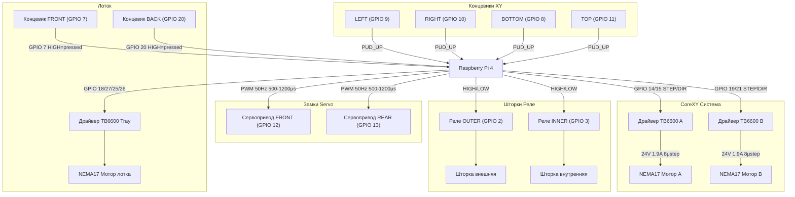

# 🔌 HARDWARE.md — Аппаратная карта BookCabinet

Актуальная карта пинов и параметров железа (источник: `bookcabinet/config.py`, `calibration.json`).

---

## GPIO-карта Raspberry Pi

### CoreXY Моторы (TB6600 драйверы)

| Мотор | Сигнал | GPIO Pin | Описание |
|-------|--------|----------|----------|
| Мотор A | STEP | 14 | Шаги мотора A |
| Мотор A | DIR | 15 | Направление мотора A |
| Мотор B | STEP | 19 | Шаги мотора B |
| Мотор B | DIR | 21 | Направление мотора B |

**CoreXY кинематика:** A+B = +X, A-B = +Y. Оба мотора вращаются вместе для каждой оси.

### Мотор лотка (Tray)

| Сигнал | GPIO Pin | Описание |
|--------|----------|----------|
| TRAY_STEP | 18 | CLK+ на драйвере — шаги лотка |
| TRAY_DIR | 27 | CW+: LOW=вперёд, HIGH=назад |
| TRAY_EN1 | 25 | Enable 1 — LOW перед работой мотора |
| TRAY_EN2 | 26 | Enable 2 — LOW перед работой мотора |

### Концевики XY

| Концевик | GPIO Pin | Активный уровень | Описание |
|----------|----------|-----------------|----------|
| SENSOR_LEFT | 9 | HIGH (1=нажат) | Левый концевик X (хоминг X) |
| SENSOR_RIGHT | 10 | HIGH (1=нажат) | Правый концевик X |
| SENSOR_BOTTOM | 8 | HIGH (1=нажат) | Нижний концевик Y (хоминг Y) |
| SENSOR_TOP | 11 | HIGH (1=нажат) | Верхний концевик Y |

> Все концевики с подтяжкой PUD_UP. Нажат = HIGH.

### Концевики лотка (Tray)

| Концевик | GPIO Pin | Активный уровень | Описание |
|----------|----------|-----------------|----------|
| SENSOR_TRAY_END | 7 | HIGH (1=нажат) | Передний концевик (спереди) |
| SENSOR_TRAY_BEGIN | 20 | HIGH (1=нажат) | Задний концевик (сзади). ⚠️ Дребезг — нужен debounce! |

### Замки (Servo PWM)

| Замок | GPIO Pin | PWM открыт | PWM закрыт | Статус |
|-------|----------|-----------|-----------|--------|
| LOCK_FRONT | 12 | 500 μs (0°) | 1200 μs (90°) | ⚠️ BROKEN — вращается только в одну сторону, нужна замена |
| LOCK_REAR | 13 | 500 μs (0°) | 1200 μs (90°) | ✅ OK |

**Частота ШИМ:** 50 Гц (стандарт для сервоприводов)

> LOCK_FRONT (пин 12) помечен как BROKEN в calibration.json. Перед использованием уточнить статус.

### Шторки (Реле GPIO)

| Шторка | GPIO Pin | HIGH | LOW | Описание |
|--------|----------|------|-----|----------|
| SHUTTER_OUTER | 2 (SDA1) | Открыта | Закрыта | Внешняя шторка (со стороны пользователя) |
| SHUTTER_INNER | 3 (SCL1) | Открыта | Закрыта | Внутренняя шторка (между шкафом и окном) |

> Шторки управляются через реле. Пины 2/3 — I²C шина, используется как GPIO. Управлять только через gpio_manager!

---

## Параметры драйверов и моторов

### Драйверы TB6600

| Параметр | Значение |
|----------|----------|
| Питание | 24V |
| Ток | 1.9A |
| Микрошаг | 8 |

### Моторы NEMA17

| Параметр | Значение |
|----------|----------|
| Модель | 17HS4023 |
| Применение | XY движение (CoreXY) |

---

## Калибровочные параметры

### XY позиции стоек (X координата, шаги)

| Стойка | X координата (шаги) |
|--------|-------------------|
| Rack 1 | 65 |
| Rack 2 | 10205 |
| Rack 3 | 20360 |

### Лоток (Tray)

| Параметр | Значение |
|----------|----------|
| total_steps | 22467 |
| center_steps | 11233 |
| freq_hz | 12000 |
| backoff_front | 1366 |
| backoff_back | 1445 |
| Дата калибровки | 2026-04-27 |

### Скорости

| Режим | Шагов/сек |
|-------|-----------|
| SLOW (хоминг) | 300 |
| HOMING_FAST | 1800 |
| NORMAL рабочий | 800–2600 |
| FAST | 3000+ |
| HARD LIMIT | 10000 |

### Границы XY

| Граница | Значение (шаги) |
|---------|----------------|
| max_x | 19948 |
| max_y | 44853 |
| steps_per_mm | 100 |

---

## Топология аппаратных соединений

---

## Известные проблемы железа

| Проблема | Компонент | Статус |
|----------|-----------|--------|
| LOCK_FRONT (GPIO 12) вращается только в одну сторону | Сервопривод замка | ⚠️ Требует замены |
| SENSOR_TRAY_BEGIN (GPIO 20) дребезг | Задний концевик лотка | 🔧 Нужен debounce |
| Шелест замков при старте | LOCK_FRONT, LOCK_REAR | ✅ Исправлено в issue #77 |
