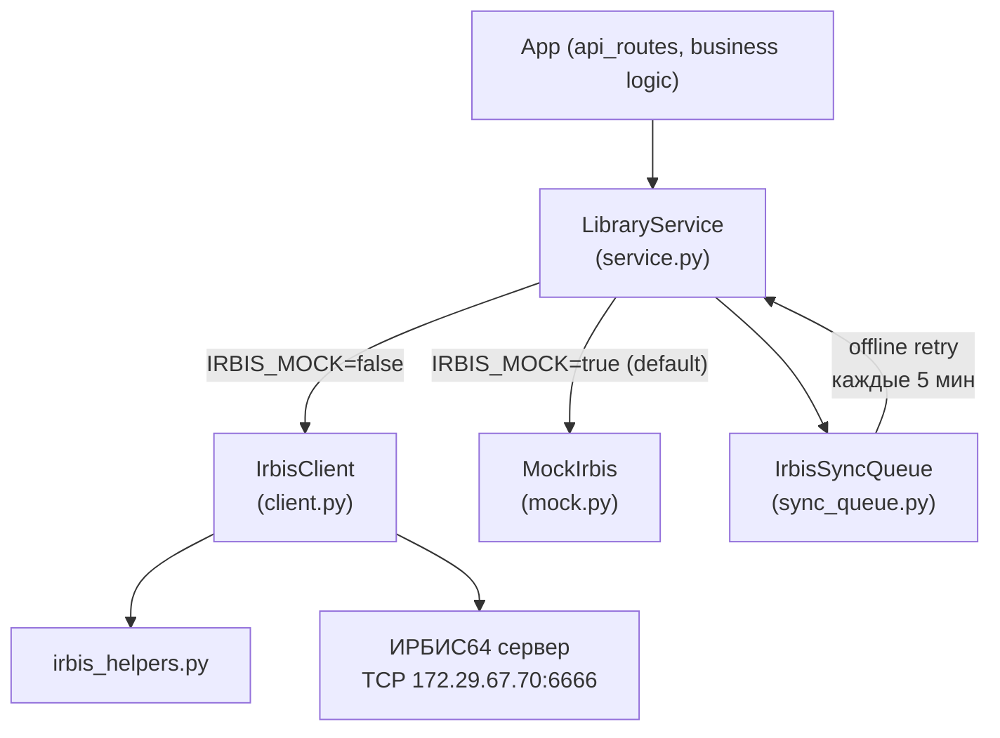
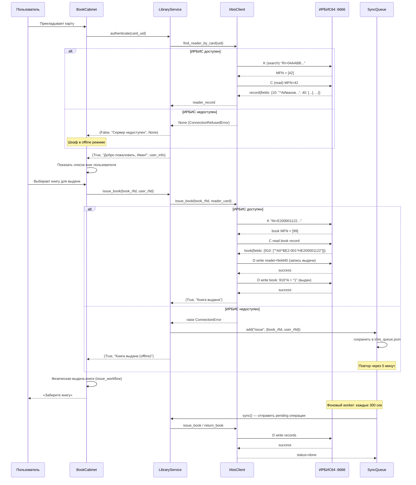

# 📚 IRBIS.md — Взаимодействие с ИРБИС64

Полное описание интеграции BookCabinet с библиотечной системой ИРБИС64.

Конфигурация → `bookcabinet/config.py` секция `IRBIS` | Смежно → [RFID.md](RFID.md)

---

## Архитектура

```
bookcabinet/irbis/
├── service.py          → LibraryService    — высокоуровневый API (используй в коде)
├── client.py           → IrbisClient       — TCP протокол ИРБИС64
├── mock.py             → MockIrbis         — заглушка для разработки
└── sync_queue.py       → IrbisSyncQueue    — offline очередь

bookcabinet/utils/
└── irbis_helpers.py                        — парсинг/форматирование записей ИРБИС
```

### Схема зависимостей



---

## Конфигурация (`config.py` секция `IRBIS`)

```python
IRBIS = {
    'mock':        os.environ.get('IRBIS_MOCK', 'true') == 'true',  # True по умолчанию!
    'host':        os.environ.get('IRBIS_HOST', '172.29.67.70'),
    'port':        int(os.environ.get('IRBIS_PORT', '6666')),
    'db':          os.environ.get('IRBIS_DB', 'IBIS'),           # база книг
    'books_db':    os.environ.get('IRBIS_BOOKS_DB', 'KAT%SERV09%'),
    'readers_db':  os.environ.get('IRBIS_READERS_DB', 'RDR'),    # база читателей
    'username':    os.environ.get('IRBIS_USERNAME', ''),          # только через ENV!
    'password':    os.environ.get('IRBIS_PASSWORD', ''),
}
```

> **Важно:** по умолчанию `IRBIS_MOCK=true`. Для работы с реальным ИРБИС нужно установить ENV переменные.

### Установка переменных окружения

```bash
export IRBIS_MOCK=false
export IRBIS_HOST=172.29.67.70
export IRBIS_PORT=6666
export IRBIS_DB=IBIS
export IRBIS_READERS_DB=RDR
export IRBIS_USERNAME=<username>
export IRBIS_PASSWORD=<password>
```

---

## Протокол ИРБИС64 TCP

**TCP порт:** 6666 (default)

### Формат запроса

```
[длина_данных]\r\n
[команда]\r\n
[workstation]\r\n
[команда (дублируется)]\r\n
[client_id]\r\n
[sequence_number]\r\n
[password]\r\n
[username]\r\n
[пустые строки x3]\r\n
[параметры...]\r\n
```

### Формат ответа

```
line 0: команда (echo)
line 1: client_id (echo)
line 2: sequence (echo)
line 3-4: служебное
line 5-9: пустые
line 10: код возврата (>=0 = успех, <0 = ошибка)
line 11+: данные
```

### Коды команд

| Команда | Описание |
|---------|----------|
| `A` | Connect — регистрация клиента |
| `B` | Disconnect — разрегистрация |
| `C` | Read record — чтение записи по MFN |
| `D` | Write record — запись/обновление записи |
| `G` | Format record — форматирование записи |
| `K` | Search — поиск, возвращает список MFN |

### Коды возврата

| Код | Описание |
|-----|----------|
| `>= 0` | Успех (кол-во записей или MFN) |
| `-1` | Сервер выполняет обновление |
| `-2` | Ошибка БД |
| `-3` | Сервер недоступен / таймаут |
| `-4` | Неверный клиент |
| `-140` | Запись логически удалена |
| `-201` | Запись заблокирована |
| `-600` | Пользователь не зарегистрирован |
| `-601` | Неверный пароль |

---

## IrbisClient — низкоуровневый TCP клиент

**Файл:** `bookcabinet/irbis/client.py`

### Методы

| Метод | Описание |
|-------|----------|
| `connect()` | Команда `A` — регистрация, устанавливает `self.connected = True` |
| `disconnect()` | Команда `B` — разрегистрация |
| `check_connection()` | Возвращает `self.connected` |
| `search(db, expr)` | Команда `K` → список MFN |
| `read_record(db, mfn)` | Команда `C` → dict полей записи |
| `search_read(db, expr)` | Поиск + чтение за один запрос (K с `@`) → список dict |
| `write_record(db, record)` | Команда `D` → bool |
| `format_record(db, mfn, fmt)` | Команда `G` → str |
| `find_reader_by_card(uid)` | Поиск читателя по UID карты (RI=, RFID=, CCUID=, EKP=) |
| `find_book_by_rfid(rfid)` | Поиск книги по RFID (IN=, H=, HI=, RF=, RFID=) |
| `find_reader_with_book(rfid)` | Кому выдана книга: H=, HIN= в базе RDR |
| `issue_book(book_rfid, reader_card)` | Полный цикл выдачи → (bool, msg) |
| `return_book(book_rfid)` | Полный цикл возврата → (bool, msg) |
| `get_user(rfid)` | Высокоуровневый — читатель по карте |
| `get_book(rfid)` | Высокоуровневый — книга по RFID |

### Поиск по RFID (make_uid_variants)

При поиске автоматически проверяются все варианты UID:

```python
from utils.irbis_helpers import make_uid_variants

variants = make_uid_variants("ABCD1234")
# Результат: ["ABCD1234", "AB:CD:12:34", "AB-CD-12-34", 
#             "3412CDAB",  # reversed bytes
#             "2882343732",  # decimal
#             ...]
```

---

## LibraryService — высокоуровневый API

**Файл:** `bookcabinet/irbis/service.py`

Синглтон `library_service = LibraryService()`. **Это основной объект для использования в коде.**

### Методы

| Метод | Описание | Возврат |
|-------|----------|---------|
| `connect()` | Подключение к ИРБИС | `bool` |
| `disconnect()` | Отключение | — |
| `check_connection()` | Проверка | `bool` |
| `authenticate(card_uid)` | Аутентификация по карте | `(bool, msg, user_info)` |
| `logout()` | Сброс текущей сессии | — |
| `get_current_user()` | Текущий авторизованный читатель | `dict` или `None` |
| `has_role(*roles)` | Проверить роль: "reader", "librarian", "admin" | `bool` |
| `get_reservations(user_rfid)` | Список книг на руках | `List[dict]` |
| `get_book_info(rfid)` | Информация о книге | `dict` или `None` |
| `issue_book(book_rfid, user_rfid)` | Выдать книгу | `(bool, msg)` |
| `return_book(book_rfid)` | Вернуть книгу | `(bool, msg)` |
| `verify_book_for_loading(rfid)` | Проверка перед загрузкой в шкаф | `{status, title, warning, can_load}` |
| `verify_book_for_extraction(rfid)` | Проверка перед изъятием | `{status, title, action}` |
| `verify_cabinet_inventory(books)` | Сверка инвентаря шкафа с ИРБИС | `{total, available, issued, not_found, problems}` |

### Типичное использование

```python
from bookcabinet.irbis.service import library_service

# Аутентификация при прикладывании карты
success, msg, user = await library_service.authenticate("04AABBCCDD")
if success:
    print(f"Добро пожаловать, {user['name']}!")  # user_info содержит name, role, rfid

# Получить список книг читателя
books = await library_service.get_reservations()

# Выдача
ok, msg = await library_service.issue_book(book_rfid="E200001122", user_rfid="04AA")

# Возврат
ok, msg = await library_service.return_book(book_rfid="E200001122")
```

---

## Структура записей ИРБИС64

### База RDR — читатели

| Поле | Описание |
|------|----------|
| `10` | ФИО: `^AФамилия^BИмя^GОтчество` |
| `30` | Идентификатор (номер билета, UID карты) |
| `40` | Выдачи (несколько): `^AШифр^BИнвентарный^CНазвание^DВыдан^EСрок^F***...^HRfid^Z<guid>` |
| `50` | Категория (Читатель / Библиотекарь / Администратор) |

### База IBIS — книги

| Поле | Описание |
|------|----------|
| `200` | Заглавие |
| `700` | Автор |
| `903` | Шифр хранения |
| `910` | Экземпляры: `^AСтатус^BИнвентарный^HRfid^KМесто...` (0=доступен, 1=выдан) |

### Статус экземпляра (поле 910^A)

| Значение | Описание |
|---------|----------|
| `"0"` | Доступен |
| `"1"` | Выдан |
| `""` | Нет данных (трактуется как доступен) |

---

## IrbisSyncQueue — offline очередь

**Файл:** `bookcabinet/irbis/sync_queue.py`

Когда ИРБИС недоступен — операции выдачи/возврата сохраняются в JSON и повторяются позже.

### Файл очереди

```
data/irbis_queue.json
```

### API очереди

| Метод | Описание |
|-------|----------|
| `add(operation, params)` | Добавить операцию в очередь |
| `get_pending()` | Все ожидающие операции |
| `get_all()` | Все операции (pending + done + failed) |
| `sync()` | Попытаться выполнить все pending → `{synced, failed, remaining}` |
| `start_periodic_sync(interval_seconds=300)` | Запустить фоновый worker (5 мин) |
| `stop_periodic_sync()` | Остановить worker |

### Формат записи очереди

```json
{
  "id": "uuid4",
  "operation": "issue",
  "params": {"book_rfid": "E200...", "user_rfid": "04AA..."},
  "added_at": "2026-04-29T14:00:00",
  "attempts": 2,
  "last_attempt": "2026-04-29T14:10:00",
  "status": "pending",
  "error": "Connection refused"
}
```

**Максимум попыток:** 10. После 10 неудач статус → `"failed"`.

### Запуск из main.py

```python
# on_startup():
from bookcabinet.irbis.sync_queue import sync_queue
sync_queue.start_periodic_sync(interval_seconds=300)  # каждые 5 минут
```

---

## irbis_helpers.py — утилиты

**Файл:** `bookcabinet/utils/irbis_helpers.py`

| Функция | Описание |
|---------|----------|
| `normalize_rfid(rfid)` | HEX без разделителей, uppercase → `"ABCDEF12"` |
| `make_uid_variants(uid)` | Все форматы UID для поиска (HEX, : - , reversed, decimal) |
| `parse_subfields(field_value)` | `"^Aval1^Bval2"` → `{"A": "val1", "B": "val2"}` |
| `format_subfields(d)` | `{"A": "val1"}` → `"^Aval1"` |
| `parse_record(text)` | Текст ИРБИС-записи → dict `{fields: {tag: [values...]}}` |
| `format_record(record)` | dict → текст для записи в ИРБИС |
| `get_field_value(record, tag, default)` | Первое значение поля |
| `get_field_values(record, tag)` | Все значения поля (список) |
| `find_exemplar_by_rfid(record, rfid)` | Найти экземпляр в поле 910 по RFID |
| `format_book_brief(record)` | Краткое название: "Автор — Заголовок" |
| `get_active_loans(record)` | Активные выдачи из поля 40 читателя |
| `find_loan_by_rfid(record, rfid)` | Индекс записи в поле 40 по RFID книги |
| `generate_guid()` | UUID4 для поля ^Z в записях выдачи |

---

## Sequence-диаграмма — полный цикл выдачи через ИРБИС



---

## Mock режим — `mock.py`

**Активируется:** `IRBIS_MOCK=true` (ENV) или `IRBIS['mock']=True` в config.

MockIrbis содержит предустановленных читателей и книги для тестирования:

| MFN | Кто | Роль | Карта |
|-----|-----|------|-------|
| 1 | Иванов Иван Иванович | Читатель | CARD001 |
| 2 | Петрова Мария Сергеевна | Читатель | CARD002 |
| 3 | Сидорова Анна Владимировна | Библиотекарь | ADMIN01 |

Используй `simulate_card()` для тестирования без железа.

---

## Troubleshooting

| Симптом | Диагностика | Решение |
|---------|-------------|---------|
| "Читатель не найден" в prod | UID в ИРБИС в другом формате | `make_uid_variants(uid)` — расширенный поиск автоматически |
| Таймаут при connect | ИРБИС недоступен или неверный host:port | Проверить ENV `IRBIS_HOST`, `IRBIS_PORT`, firewall |
| return_code -600 | Неверный логин | Проверить `IRBIS_USERNAME`, `IRBIS_PASSWORD` |
| return_code -601 | Неверный пароль | Аналогично |
| Операции накапливаются в очереди | ИРБИС долго недоступен | Проверить сеть, `data/irbis_queue.json` — список pending |
