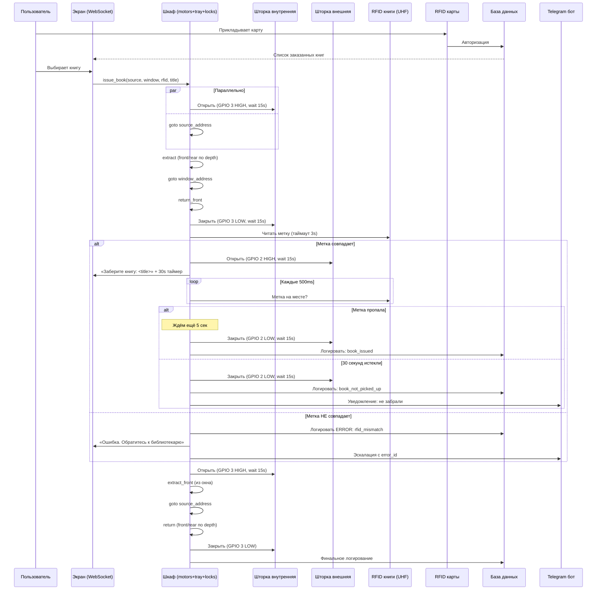
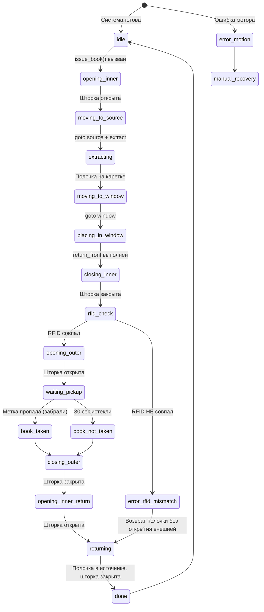
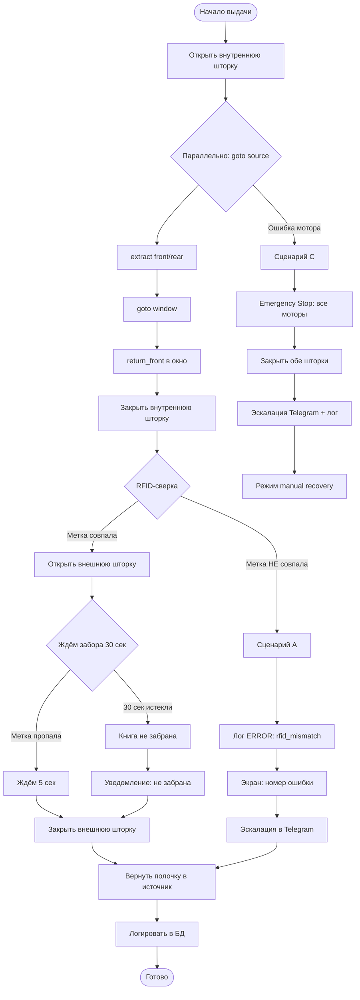

# 📤 ISSUE_BOOK_WORKFLOW.md — Цикл выдачи книги

Полное ТЗ workflow выдачи книги. Источник: GitHub issue #79.

Реализуется в `bookcabinet/workflows/issue.py`.

---

## Входные параметры

| Параметр | Тип | Описание |
|----------|-----|----------|
| `source_address` | str | Адрес ячейки-источника, например `2.1.16` |
| `window_address` | str | Адрес окна выдачи (по умолчанию `1.2.9`) |
| `expected_book_rfid` | str | RFID метка ожидаемой книги |
| `book_title` | str | Название книги для экрана |
| `speed` | int | Скорость каретки (default 2600) |
| `pickup_timeout_sec` | int | Таймаут ожидания забора (default 30) |

---

## Последовательность выдачи

| # | Действие | Параллельно |
|---|----------|-------------|
| 1 | Запуск `issue_book(source, window, rfid, title)` | |
| 2 | **Открыть внутреннюю шторку** (GPIO 3→HIGH, wait 15s) | + `goto source` через `asyncio.gather` |
| 3 | Извлечь полочку: `extract_rear` если depth=2, `extract_front` если depth=1 | |
| 4 | `goto window` (внутренняя уже открыта) | |
| 5 | Положить полочку в окно: `return_front` если window_depth=1 | |
| 6 | **Закрыть внутреннюю шторку** (GPIO 3→LOW, wait 15s) | |
| 7 | **RFID-сверка:** book_reader читает метку 3 сек | |
|   | • Совпадает → шаг 8 | |
|   | • НЕ совпадает → сценарий А | |
| 8 | **Открыть внешнюю шторку** (GPIO 2→HIGH, wait 15s) | |
| 9 | Экран: «Заберите книгу: `<title>`» + обратный отсчёт 30 сек | |
| 10 | Опрос каждые 500ms: RFID метка ещё на полке? | |
| 11 | Первое из: метка пропала (→ ждём 5s → шаг 12) или 30s истекли (→ шаг 12) | |
| 12 | **Закрыть внешнюю шторку** (GPIO 2→LOW, wait 15s) | |
| 13 | **Открыть внутреннюю шторку** (GPIO 3→HIGH, wait 15s) | |
| 14 | Извлечь полочку из окна (`extract_front`) | |
| 15 | `goto source` — везём полочку обратно | |
| 16 | Положить полочку в источник (`return_front` или `return_rear` по depth) | |
| 17 | **Закрыть внутреннюю шторку** (GPIO 3→LOW) | |
| 18 | Логировать в БД: успешная выдача + статус (забрана/не забрана) | |

---

## Sequence-диаграмма полного потока

---

## State-диаграмма состояний выдачи

---

## Flowchart — ошибочные сценарии

---

## Ошибочные сценарии

### А) RFID метка не совпала (шаг 7)

1. Логировать в `system_log`: `level=ERROR, source=issue_workflow` — несоответствие метки
2. Экран: «Произошла ошибка при выдаче. Номер ошибки: `<error_id>`. Обратитесь к библиотекарю.»
3. Эскалация в Telegram (`monitoring/telegram.py`)
4. Вернуть полочку в исходную ячейку (шаги 13–17 **без** открытия внешней шторки)

### Б) Книга не забрана за 30 сек

1. Закрыть внешнюю шторку
2. Логировать: `book_not_picked_up` с book_id и user_id
3. Полочка возвращается в исходную ячейку
4. Уведомление в Telegram

### В) Ошибка движения (концевик не сработал, stall)

1. Emergency stop: все моторы остановить
2. Закрыть обе шторки
3. Эскалация в Telegram + журнал `system_log`
4. Шкаф в режим `manual_recovery`

---

## Зависимости (готовые модули)

| Модуль | Расположение | Статус |
|--------|-------------|--------|
| move_shelf.py | `tools/move_shelf.py` | ✅ Готов |
| shelf_operations.py | `tools/shelf_operations.py` | ✅ Готов |
| shutter.py | `tools/shutter.py` | ✅ Готов |
| shutters.py | `bookcabinet/hardware/shutters.py` | ✅ Готов |
| book_reader.py | `bookcabinet/rfid/book_reader.py` | ✅ Есть UHF ридер |
| websocket_handler.py | `bookcabinet/server/websocket_handler.py` | ✅ Для экрана |
