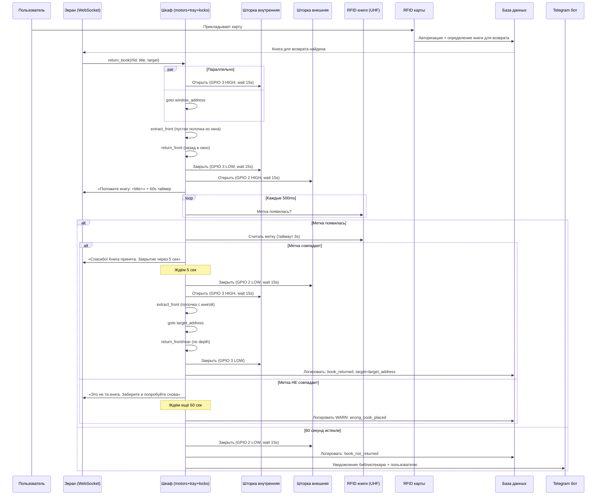
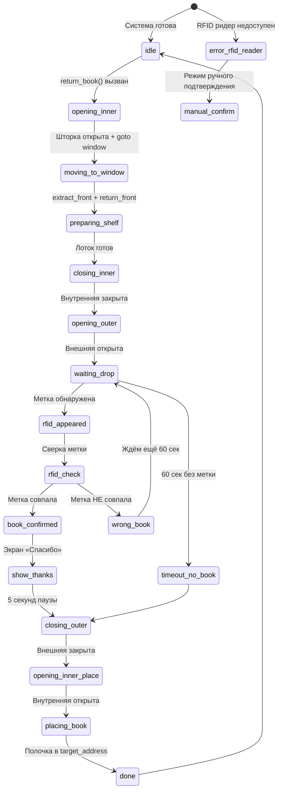
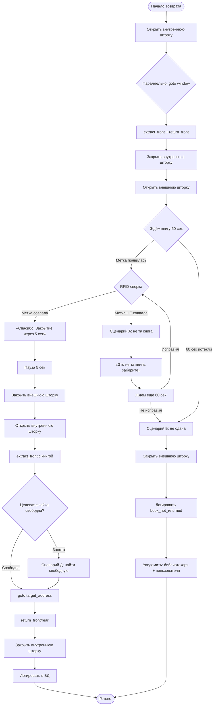

# 📥 RETURN_BOOK_WORKFLOW.md — Цикл возврата книги

Полное ТЗ workflow возврата книги. Источник: GitHub issue #80.

Реализуется в `bookcabinet/workflows/return.py`.

> **Главное отличие от выдачи:** метка ПОЯВЛЯЕТСЯ (а не пропадает), сверка после появления, fallback на свободную ячейку.

---

## Входные параметры

| Параметр | Тип | Описание |
|----------|-----|----------|
| `expected_book_rfid` | str | RFID метка возвращаемой книги |
| `book_title` | str | Название для экрана |
| `target_address` | str | Куда положить книгу (определяется по каталогу/свободным ячейкам) |
| `window_address` | str | Окно приёма (по умолчанию `1.2.9`) |
| `speed` | int | Скорость каретки (default 2600) |
| `drop_timeout_sec` | int | Таймаут ожидания сдачи книги (default 60) |

---

## Последовательность возврата

| # | Действие | Параллельно |
|---|----------|-------------|
| 1 | Запуск `return_book(rfid, title, target)` | |
| 2 | **Открыть внутреннюю шторку** (~15 сек) | + `goto window` через `asyncio.gather` |
| 3 | Извлечь пустую полочку из окна (`extract_front`) | |
| 4 | Положить обратно в окно (`return_front`) | |
| 5 | **Закрыть внутреннюю шторку** (15 сек) | |
| 6 | **Открыть внешнюю шторку** (15 сек) | |
| 7 | Экран: «Положите книгу: `<title>`» + обратный отсчёт 60 сек | |
| 8 | RFID-опрос каждые 500ms: появилась ли метка? | |
| 9 | Первое из: метка появилась (→ шаг 10) или 60s истекли (→ сценарий Б) | |
| 10 | **RFID-сверка:** считанная метка == `expected_book_rfid`? | |
|    | • Совпадает → шаг 11 | |
|    | • НЕ совпадает → сценарий А | |
| 11 | Экран: «Спасибо! Книга принята. Шторка закроется через 5 сек.» | |
| 12 | Ждём 5 сек (UX: пользователь видит подтверждение) | |
| 13 | **Закрыть внешнюю шторку** (15 сек) | |
| 14 | **Открыть внутреннюю шторку** (15 сек) | |
| 15 | Извлечь полочку с книгой из окна (`extract_front`) | |
| 16 | `goto target_address` | |
| 17 | Положить полочку (`return_front` или `return_rear` по depth) | |
| 18 | **Закрыть внутреннюю шторку** | |
| 19 | Логировать в БД: успешный возврат + обновить catalog (книга на `target_address`) | |

---

## Sequence-диаграмма полного потока

---

## State-диаграмма состояний возврата

---

## Flowchart — ошибочные сценарии

---

## Ошибочные сценарии

### А) Положили не ту книгу (шаг 10)

1. Экран: «Это не та книга. Заберите и попробуйте снова. Номер ошибки: `<error_id>`»
2. **НЕ закрывать** внешнюю шторку — даём 60 сек на исправление
3. Логировать: `system_log WARN`
4. Если за 60 сек не исправили → закрыть, эскалация в Telegram

### Б) Книга не сдана за 60 сек

1. Закрыть внешнюю шторку
2. Логировать: `book_not_returned`
3. Полочка остаётся в окне (повторная попытка возможна)
4. Уведомление пользователю и библиотекарю

### В) RFID-ридер не отвечает

1. Режим `manual_confirm`: пользователь жмёт «Я положил книгу» на экране
2. Эскалация: библиотекарь вручную сверит RFID при следующем приходе
3. Логировать: `rfid_reader_error`

### Д) Целевая ячейка занята

1. **Auto-fallback**: найти ближайшую свободную ячейку через `shelf_data.db`
2. Логировать переадресацию: `target_redirected: original → new`
3. Продолжить как обычно с новым адресом

---

## Зависимости (готовые модули)

| Модуль | Расположение | Статус |
|--------|-------------|--------|
| move_shelf.py | `tools/move_shelf.py` | ✅ Готов |
| shelf_operations.py | `tools/shelf_operations.py` | ✅ Готов |
| shutter.py | `tools/shutter.py` | ✅ Готов |
| book_reader.py | `bookcabinet/rfid/book_reader.py` | ✅ UHF ридер |
| database.py | `bookcabinet/database.py` | ✅ Поиск свободных ячеек |
| websocket_handler.py | `bookcabinet/server/websocket_handler.py` | ✅ Экран |
