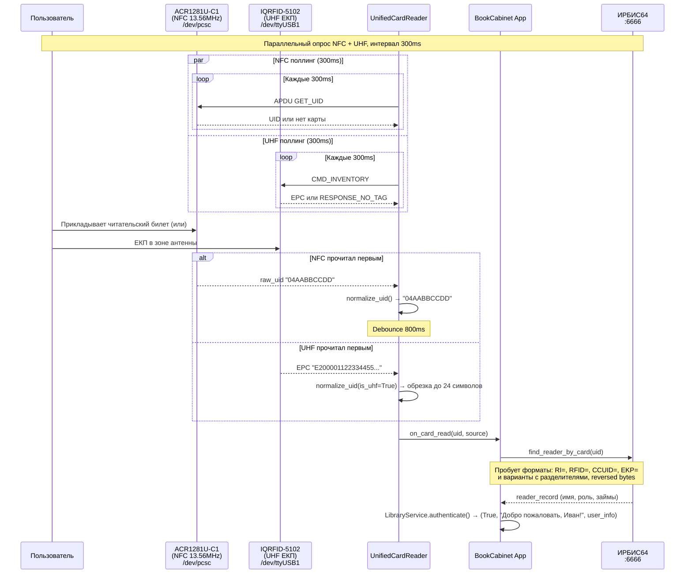

# 📡 RFID.md — Считыватели BookCabinet

Полное описание всех RFID-считывателей: драйверы, протоколы, подключение, применение.

Конфигурация → `bookcabinet/config.py` секция `RFID` | Быстрые команды → [QUICK_REFERENCE.md](QUICK_REFERENCE.md)

---

## Сводная таблица считывателей

| # | Считыватель | Стандарт | Интерфейс | Применение | Модуль |
|---|-------------|----------|-----------|------------|--------|
| A | ACR1281U-C1 | NFC 13.56 MHz | USB (PC/SC) | Читательский билет | `rfid/card_reader.py` |
| B | IQRFID-5102 | UHF 900 MHz | Serial `/dev/ttyUSB2` | Метки книг | `rfid/book_reader.py` |
| C | IQRFID-5102 | UHF 900 MHz | Serial `/dev/ttyUSB1` | ЕКП карты | `hardware/iqrfid5102_driver.py` |
| D | UnifiedCardReader | NFC + UHF | — | Объединяет A+C | `rfid/unified_card_reader.py` |
| E | RRU9816 Sidecar | UHF | COM2 serial | Legacy/опциональный | `rru9816-sidecar/` (C#) |

---

## A) ACR1281U-C1 — читательский билет (NFC 13.56 MHz)

**Файл:** `bookcabinet/rfid/card_reader.py`

**Назначение:** Идентификация пользователя по читательскому билету или Mifare-карте библиотеки.

### Подключение

| Параметр | Значение |
|----------|----------|
| Интерфейс | USB → PC/SC |
| Путь устройства | `/dev/pcsc` (config `RFID['nfc_card_reader']`) |
| Библиотека | `pyscard` (`smartcard.System.readers`) |

### Ключевые методы

| Метод | Описание |
|-------|----------|
| `connect()` | Открыть соединение через PC/SC, взять первый доступный ридер |
| `start_monitoring()` | Запустить фоновый цикл опроса (asyncio task) |
| `read_card()` | Одиночное чтение: APDU `[0xFF, 0xCA, 0x00, 0x00, 0x00]` → UID |
| `stop_monitoring()` | Остановить опрос |
| `simulate_card(uid, type)` | Mock: вызвать `on_card_read` с синтетическими данными |

### APDU команда GET UID

```python
GET_UID = [0xFF, 0xCA, 0x00, 0x00, 0x00]
# Ответ: data (UID bytes) + sw1=0x90, sw2=0x00
uid = ''.join(format(x, '02X') for x in data)
```

### Режим mock

При `MOCK_MODE=true` или отсутствии `pyscard` — автоматически переходит в mock. `read_card()` возвращает `None`.

---

## B) IQRFID-5102 — считыватель меток книг (UHF 900 MHz)

**Файл:** `bookcabinet/rfid/book_reader.py`

**Назначение:** Чтение RFID-меток UHF на книгах. Используется в окне выдачи для:
- Сверки что именно та книга (issue #79, шаг 7)
- Обнаружения исчезновения метки (книгу забрали, issue #79, шаги 10–11)
- Обнаружения появления метки (книгу положили, issue #80, шаги 8–10)

### Подключение

| Параметр | Значение |
|----------|----------|
| Интерфейс | Serial UART |
| Путь | `/dev/ttyUSB2` (fallback `/dev/ttyUSB0`) |
| Baudrate | 57600 |
| Библиотека | `pyserial` |
| Config | `RFID['book_reader']`, `RFID['book_baudrate']` |

### Протокол IQRFID-5102

Бинарный фрейм с CRC-16:

```
[Len][Addr][Cmd][Data...][CRC16-L][CRC16-H]
  1    1    1                1       1
```

**CRC-16:** polynomial `0x8408`, init `0xFFFF` (CCITT-FALSE reversed):

```python
def crc16(data: bytes) -> int:
    crc = 0xFFFF
    for byte in data:
        crc ^= byte
        for _ in range(8):
            if crc & 0x0001:
                crc = (crc >> 1) ^ 0x8408
            else:
                crc >>= 1
    return crc
```

### Команды

| Константа | Код | Описание |
|-----------|-----|----------|
| `CMD_INVENTORY` | `0x01` | Инвентаризация — получить все метки в поле |
| `CMD_READ_DATA` | `0x02` | Чтение данных из памяти метки |
| `CMD_WRITE_DATA` | `0x03` | Запись данных в метку |
| `CMD_SET_POWER` | `0xB6` | Установить мощность антенны (5–30 dBm) |

### Коды ответа

| Код | Константа | Описание |
|-----|-----------|----------|
| `0x01` | `RESPONSE_OK` | Метки найдены |
| `0xFB` | `RESPONSE_NO_TAG` | Метки в поле отсутствуют |
| `0xFC` | `RESPONSE_ERROR` | Ошибка |

### Формат ответа Inventory

```
[Len][Addr][ReCode][AntID][NumTag][TagData...][CRC16-L][CRC16-H]

Каждый TagData:
[Count][EPC_Len][PC(2 bytes)][EPC(EPC_Len-2 bytes)][RSSI]
```

### Ключевые методы

| Метод | Описание |
|-------|----------|
| `connect()` | Открыть serial `/dev/ttyUSB2` |
| `inventory()` | Получить список EPC строк всех меток в поле |
| `read_epc()` | Первая найденная метка или `None` |
| `set_power(dbm)` | Мощность антенны 5–30 dBm |
| `start_polling(interval)` | Фоновое сканирование с callback `on_tag_read` |
| `get_last_inventory_meta()` | Метаданные: antenna_id, num_tags, rssi |
| `simulate_tag(epc)` | Mock: добавить синтетическую метку |

### Использование в workflow (issue #79 и #80)

```python
# Сверка метки — ждём до 3 сек
async def check_rfid(expected_rfid: str, timeout_sec: float = 3.0) -> bool:
    deadline = asyncio.get_event_loop().time() + timeout_sec
    while asyncio.get_event_loop().time() < deadline:
        tags = await book_reader.inventory()
        if expected_rfid in tags:
            return True
        await asyncio.sleep(0.5)
    return False

# Ждём исчезновения метки (книгу забрали)
async def wait_book_taken(rfid: str, timeout_sec: float = 30.0) -> bool:
    deadline = asyncio.get_event_loop().time() + timeout_sec
    while asyncio.get_event_loop().time() < deadline:
        tags = await book_reader.inventory()
        if rfid not in tags:
            await asyncio.sleep(5.0)  # ждём ещё 5 сек для UX
            return True
        await asyncio.sleep(0.5)
    return False  # таймаут

# Ждём появления метки (книгу положили)
async def wait_book_placed(timeout_sec: float = 60.0) -> Optional[str]:
    deadline = asyncio.get_event_loop().time() + timeout_sec
    while asyncio.get_event_loop().time() < deadline:
        tags = await book_reader.inventory()
        if tags:
            return tags[0]
        await asyncio.sleep(0.5)
    return None
```

---

## C) IQRFID-5102 — считыватель ЕКП карт (UHF 900 MHz)

**Файл:** `bookcabinet/hardware/iqrfid5102_driver.py`

**Назначение:** Считывание **Единой Карты Петербуржца (ЕКП)** — UHF-карта как альтернативный идентификатор читателя.

### Подключение

| Параметр | Значение |
|----------|----------|
| Интерфейс | Serial UART |
| Путь | `/dev/ttyUSB1` (config `RFID['uhf_card_reader']`, fallback `ttyUSB1`) |
| Baudrate | 57600 |

### Отличие от book_reader.py

Это **отдельная инстанция** того же класса `IQRFID5102`. Используется только `UnifiedCardReader` (не напрямую в приложении).

### Ключевые методы `IQRFID5102`

| Метод | Описание |
|-------|----------|
| `connect()` | Подключение + ping (отправляет INVENTORY, ждёт ответ ≥5 байт) |
| `inventory(rounds=1)` | Сканирование меток, возвращает список EPC |
| `disconnect()` | Закрыть serial |

---

## D) UnifiedCardReader — параллельный опрос NFC + UHF

**Файл:** `bookcabinet/rfid/unified_card_reader.py`

**Назначение:** При подходе пользователя к шкафу одновременно опрашивает оба считывателя (A+C). Первый, кто прочитал карту — победил.

### Применение в приложении

```python
from rfid.unified_card_reader import unified_reader

def on_card(uid: str, source: str):
    # uid — нормализованный UID (HEX без разделителей, uppercase)
    # source — 'nfc' или 'uhf'
    print(f"Карта {uid} от {source}")

unified_reader.on_card_read = on_card
await unified_reader.connect()
await unified_reader.start(poll_interval=0.3)
```

### Нормализация UID

```python
def normalize_uid(raw_uid: str, is_uhf: bool = False) -> str:
    uid = raw_uid
    uid = re.sub(r'[:\-\s]', '', uid)   # убрать разделители
    uid = uid.upper()                    # верхний регистр
    if is_uhf and len(uid) > 24:
        uid = uid[:24]                   # EPC обрезка до 24 символов
    return uid
```

| Параметр | Значение |
|----------|----------|
| `UHF_CARD_UID_LENGTH` | 24 символа (EPC до 24 hex-символов) |
| `DEBOUNCE_MS` | 800 мс — защита от повторных срабатываний |
| Интервал опроса | 300 мс (default) |

### Конфигурация

```python
unified_reader.configure(
    uhf_port='/dev/ttyUSB1',   # порт ЕКП ридера
    mock_mode=False,
)
```

### Mock симуляция

```python
unified_reader.simulate_card("04AABBCCDD", "nfc")   # NFC карта
unified_reader.simulate_card("E200001122334455", "uhf")  # UHF ЕКП
```

---

## E) RRU9816 Sidecar — legacy UHF (C# .NET)

**Директория:** `rru9816-sidecar/`

**Назначение:** Альтернативный UHF RFID-ридер. Реализован на C#/.NET как отдельный sidecar-процесс. Общается с основным приложением через WebSocket.

### Технические детали

| Параметр | Значение |
|----------|----------|
| Подключение к устройству | COM2 @ 57600 baud |
| Интерфейс к приложению | WebSocket `ws://localhost:8081/` |
| Статус | ✅ Рабочий (September 2025) |
| Режим инвентаризации | Dual-mode: буферный + прямой (fallback) |

### WebSocket API

**Команды → sidecar:**

```json
{"command": "connect",          "port": "COM2", "baudRate": 57600}
{"command": "start_inventory"}
{"command": "stop_inventory"}
{"command": "disconnect"}
```

**События ← sidecar:**

```json
{"type": "connected",   "port": "COM2", "message": "..."}
{"type": "tag_read",    "epc": "B75F196000210015983E", "rssi": -35.7, "timestamp": "..."}
{"type": "inventory_started"}
{"type": "error",       "message": "..."}
```

---

## Архитектура потока идентификации пользователя



---

## Конфигурация (`config.py` секция `RFID`)

```python
RFID = {
    'nfc_card_reader':        '/dev/pcsc',       # ACR1281U-C1
    'uhf_card_reader':        '/dev/ttyUSB1',    # IQRFID-5102 для ЕКП
    'uhf_card_baudrate':      57600,
    'book_reader':            '/dev/ttyUSB2',    # IQRFID-5102 для книг
    'book_baudrate':          57600,
    'uhf_card_reader_fallback': '/dev/ttyUSB1',  # fallback
    'book_reader_fallback':   '/dev/ttyUSB0',    # fallback
    'card_poll_interval':     0.3,               # секунд
    'card_debounce_ms':       800,               # мс
    'uhf_card_uid_length':    24,                # символов EPC
}
```

---

## Troubleshooting

| Симптом | Диагностика | Решение |
|---------|-------------|---------|
| NFC ридер не найден | `python3 -c "from smartcard.System import readers; print(readers())"` | Проверить USB, установить pcscd: `sudo apt install pcscd` |
| book_reader не отвечает | `ls -la /dev/ttyUSB*` | Проверить порт (ttyUSB2 или ttyUSB0), переподключить USB |
| ЕКП ридер не отвечает | Проверить `/dev/ttyUSB1` | Аналогично book_reader |
| EPC обрезается неверно | Длина uid > 24 → первые 24 — UID | Нормально, см. UHF_CARD_UID_LENGTH |
| Дребезг карты (двойное срабатывание) | `DEBOUNCE_MS = 800` | Увеличить если нужно |
