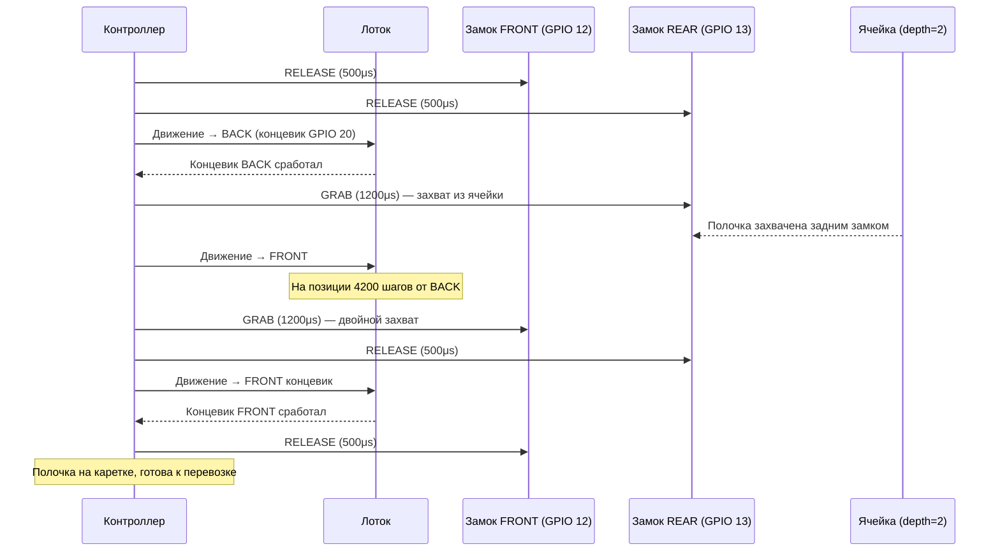
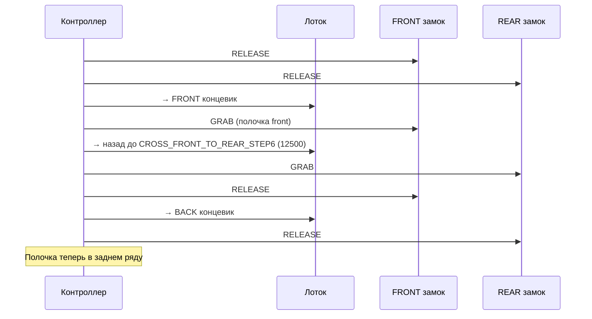

# 🔧 SHELF_OPERATIONS.md — Алгоритмы работы с полочками

Подробное описание механики работы с полочками: замки, лоток, точки перехвата.

Быстрые команды → [QUICK_REFERENCE.md](QUICK_REFERENCE.md) | Пины → [HARDWARE.md](HARDWARE.md)

---

## Концепция перехвата замков (Handoff)

Каждая полочка удерживается двумя замками: **передним (FRONT)** и **задним (REAR)**. Суть операции — передать полочку от одного замка к другому, выдвигая/задвигая лоток.

**Принцип:** в момент "перехвата" оба замка кратковременно держат полочку, затем один отпускает.

### Точки перехвата (откалибровано 21.04.2026)

```python
TRAY_CENTER = 11300         # центр лотка

# Задний ряд (depth=2)
REAR_HANDOFF_REAR_FROM_BACK = 16800   # лоток выдвинут до заднего замка
REAR_HANDOFF_FRONT_FROM_BACK = 4200   # лоток задвинут до переднего замка
LOCK_DISTANCE = 12600                  # расстояние между замками по оси лотка

# Передний ряд (depth=1)  
FRONT_HANDOFF_FRONT_FROM_BACK = 5700  # передний замок на середине каретки
FRONT_HANDOFF_REAR_FROM_BACK = 18300  # задний замок на середине каретки
```

### PWM замков

| Состояние | PWM (μs) | Угол | Описание |
|-----------|----------|------|----------|
| RELEASE | 500 | 0° | Замок открыт — полочка может скользить |
| GRAB | 1200 | ~90° | Замок закрыт — полочка зафиксирована |

---

## extract_rear — извлечь из заднего ряда

Цель: вытащить полочку из ячейки глубины 2 на лоток каретки.

### Пошаговый алгоритм

1. **Оба замка в RELEASE** (пины 12 и 13 → 500 μs)
2. **Лоток → задний концевик** (ENDSTOP_BACK, GPIO 20)
3. **REAR замок → GRAB** (пин 13 → 1200 μs)  
   *Задний замок захватывает полочку из ячейки*
4. **Лоток движется к переднему концевику** (ENDSTOP_FRONT, GPIO 7)  
   *Полочка едет вперёд на лотке*
5. **На позиции REAR_HANDOFF_FRONT_FROM_BACK (4200 шагов от заднего)**  
   **FRONT замок → GRAB** (пин 12 → 1200 μs)  
   *Передний замок захватывает полочку*
6. **REAR замок → RELEASE** (пин 13 → 500 μs)
7. **Лоток → передний концевик** до упора
8. **Обоими замками RELEASE** — полочка остаётся на каретке

### Sequence-диаграмма extract_rear



---

## return_rear — вернуть в задний ряд

Цель: положить полочку с каретки обратно в ячейку depth=2.

### Пошаговый алгоритм

1. **Оба замка RELEASE**
2. **Лоток → передний концевик** (ENDSTOP_FRONT)
3. **FRONT замок → GRAB** — захват полочки на каретке
4. **Лоток движется назад**
5. **На позиции REAR_HANDOFF_REAR_FROM_BACK (16800 шагов от BACK)**  
   **REAR замок → GRAB**  
   *Задний замок захватывает для передачи в ячейку*
6. **FRONT замок → RELEASE**
7. **Лоток → задний концевик**  
   *Полочка уходит в ячейку*
8. **REAR замок → RELEASE** (полочка осталась в ячейке)
9. **Лоток → FRONT** (возврат лотка в исходное)

---

## extract_front — извлечь из переднего ряда

### Пошаговый алгоритм

1. **Оба замка RELEASE**
2. **Лоток → передний концевик** (ENDSTOP_FRONT)
3. **FRONT замок → GRAB** — захват полочки из ячейки depth=1
4. **Лоток движется назад**
5. **На позиции FRONT_HANDOFF_REAR_FROM_BACK (18300 шагов от BACK)**  
   **REAR замок → GRAB**
6. **FRONT замок → RELEASE**
7. **Лоток продолжает назад**
8. **На позиции FRONT_HANDOFF_FRONT_FROM_BACK (5700 шагов от BACK)**  
   **FRONT замок → GRAB**
9. **REAR замок → RELEASE**
10. **Лоток → передний концевик**

---

## return_front — вернуть в передний ряд

Зеркальная операция к extract_front. Полочка с каретки укладывается обратно в ячейку depth=1.

---

## front_to_rear / rear_to_front — кросс-рядная перекладка

**Важно:** это перекладка **В ОДНОЙ ячейке**, не перенос между ячейками!

Используется когда нужно переместить полочку между передним и задним рядом одной и той же позиции.

### Константы (откалибровано 21.04.2026)

```python
CROSS_FRONT_TO_REAR_STEP6 = 12500   # front_to_rear: промежуточная позиция
CROSS_REAR_TO_FRONT_STEP4 = 12700   # rear_to_front: промежуточная позиция
CROSS_REAR_TO_FRONT_STEP6 = 12600   # rear_to_front: финальная передача
```

### front_to_rear — из переднего в задний (одна ячейка)



### rear_to_front — из заднего в передний (одна ячейка)

Зеркально front_to_rear с использованием констант CROSS_REAR_TO_FRONT_*.

---

## Важные замечания

1. **Никогда не вызывай shelf_operations без goto!** Каретка должна стоять в нужной ячейке.
2. **strong=True у lock_release** — используется в критических позициях, команда отправляется 3 раза.
3. **sensor_stable()** — дебаунс концевика: требует 5 подряд стабильных HIGH перед остановкой.
4. **TRAY_FREQ = 12000 Hz** — фиксированная частота шагов лотка, скорость регулируется шагами.
